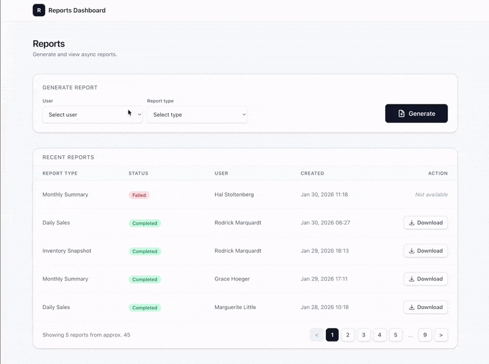

# Reports Dashboard



## Technical Highlights

- **Real-time status updates** via Action Cable (Turbo Streams broadcast) with no polling
- **Async PDF generation** with Sidekiq + headless Chrome in Docker (Grover/Puppeteer)
- **Strategy pattern** for pluggable report data sources, swappable without changing callers
- **Pagination with cached counts** (Pagy `:countish`) to avoid `COUNT(*)` on every request
- **Turbo-native UX**: form submission, toast notifications, and list updates without full page reloads
- **Responsive reports list**: divs + CSS Grid (not `<table>`) for a single layout that adapts from table-like on desktop to card-like on mobile, with one DOM element per report and one broadcast per update
- **One-command setup**: `just setup` boots infrastructure, installs dependencies, and seeds the database

### Architecture

```
Browser (Turbo/Stimulus)
  │
  ├── POST /reports ──→ ReportsController#create
  │                        ├── Report.create (pending)
  │                        └── ReportGeneratorJob.perform_later
  │                              │
  │                              ▼
  │                        Sidekiq Worker
  │                              │
  │                        GenerateReportService
  │                          ├── ReportData::Reports.fetch (Strategy pattern)
  │                          ├── ReportPdfRenderer → Grover → Chrome (Docker)
  │                          ├── ActiveStorage.attach (PDF blob)
  │                          └── Turbo::StreamsChannel.broadcast_replace_to
  │                              │
  │◄─── Action Cable ◄───────────┘
  │     (live row update)
  │
  └── GET /reports/:id/download ──→ ActiveStorage redirect
```

## Requirements

- Ruby 3.4.1
- Node.js 22+ (for Grover PDF generation)
- Docker (PostgreSQL 17, Redis 7, and Chrome for PDF generation run via Docker Compose — no local install needed)
- [direnv](https://direnv.net/) — `brew install direnv`
- [just](https://github.com/casey/just) — `brew install just`

Add the direnv hook to your shell config:

```bash
# zsh (~/.zshrc)
eval "$(direnv hook zsh)"

# bash (~/.bashrc)
eval "$(direnv hook bash)"

# fish (~/.config/fish/config.fish)
direnv hook fish | source
```

## Setup

Execute in order:

1. `cp .envrc.sample .envrc` — Copy env template. `RAILS_MASTER_KEY` is not required for development.
2. `direnv allow` — Approve the `.envrc` file.
3. `just setup` — Start services, install deps, seed database. The seed creates reports with status `pending` and `failed` (1 failed every 5), enqueues pending reports via Active Job, and exits quickly.
4. `just dev` — Start Rails + Sidekiq. Pending reports from seeds are processed in the background; create new reports from the form, PDF generation runs in the background.

```bash
cp .envrc.sample .envrc
direnv allow
just setup
just dev
```

> You can also run `just server` and `just sidekiq` in separate terminals if you prefer.
>
> **Seeds:** After `just setup`, pending reports remain enqueued in Redis. Run `just dev` so Sidekiq processes them and generates PDFs in the background.

## Available commands

Run `just` to see all available recipes:

```
just                   # List all commands
just setup             # Full project setup from scratch
just services-up       # Start infrastructure (PostgreSQL + Redis + Chrome)
just services-down     # Stop infrastructure
just install           # Install dependencies (bundle, npm, rails_icons sync)
just icons-sync        # Sync rails_icons SVG assets (heroicons, animated)
just services-status   # Show services status
just services-logs     # Follow services logs
just services-nuke     # Remove services and volumes (destructive)
just db-setup          # Create, migrate, and seed
just db-migrate        # Run pending migrations
just db-rollback       # Rollback last migration
just db-reset          # Drop, create, migrate, seed
just db-console        # Open PostgreSQL console
just server            # Start Rails server
just dev               # Start Rails server + Sidekiq together
just console           # Start Rails console
just sidekiq           # Start Sidekiq worker
just test              # Run test suite (RSpec)
just test-failures     # Re-run only failed tests
just lint              # Run RuboCop linter
just lint-fix          # Run RuboCop with auto-correct
just security          # Run Brakeman security scanner
just ci                # Run all checks locally (lint + security + tests)
just redis-cli         # Open Redis CLI
just redis-flush       # Flush Redis cache
```

## Report Data

Report data is fetched via `ReportData::Reports.fetch(report_type)`. The current implementation uses **mocked classes** (Faker-generated data) under `app/services/report_data/reports/`. These can be swapped for real implementations (e.g. database queries, external APIs) without changing the caller. Just replace the fetcher classes behind the same interface.

**Report types:** `daily_sales`, `monthly_summary`, `inventory_snapshot`

**Monetary values:** All prices and totals are returned as **integers in cents** (e.g. the last two digits are the cents part, so `1299` = $12.99). The system assumes a single currency (**USD**). This format is compatible with the [money-rails](https://github.com/RubyMoney/money-rails) gem if we need it.

## Design Decisions & Trade-offs

- **Report uniqueness constraint:** The auto-generated `code` field (`REPORT_TYPE-YYYYMMDD-USERID`) inherently encodes the user, report type, and date. A single unique index on `code` is sufficient to enforce the one-report-per-type-per-user-per-day rule, avoiding the need for a multi-column composite index.

- **User deletion and report retention:** Currently `has_many :reports, dependent: :destroy` is used for simplicity. In production, users should not be hard-deleted because their reports need to be preserved. A soft-delete approach using `paranoia` (`with_deleted` scope) would allow deactivating users while keeping their reports intact.

- **Integer enums vs PostgreSQL native enums:** Report `status` and `report_type` use Rails integer-backed enums instead of PostgreSQL native enum types. PG enums are self-documenting at the DB level and provide type safety, but require migrations to add or modify values. For the simplicity of this project, integer-backed enums are the right choice. They are easy to evolve, well-supported by Rails, and adding a new report type is a one-line change in the model with no migration needed.

- **Job retry and idempotency:** `ReportGeneratorJob` currently has no explicit `retry_on` / `discard_on` configuration and relies on Sidekiq's default retry behavior. The service does not guard against being called twice for the same report (e.g. on retry after a transient failure). For MVP scope this is acceptable because failures are caught, logged, and the report is marked `failed`. In production we would add an idempotency guard (`return unless report.pending?`), configure `retry_on StandardError, wait: :polynomially_longer, attempts: 3`, and add `discard_on ActiveRecord::RecordNotFound` to handle edge cases gracefully.

- **Test coverage scope:** The test suite covers model validations, request specs, service behavior, and job delegation, excluding system tests (Capybara) due to time limits, despite having `capybara` and `selenium-webdriver` in the Gemfile. For a Hotwire/Turbo app, system tests should verify end-to-end flows like form submission, toast notifications, table updates, and Action Cable updates. Helper tests for `format_currency_html` and `status_badge_class` are deferred. These methods are tested indirectly, but edge-case tests (nil, zero, negative, large values) would be useful.

- **`result_data` parsing responsibility:** `ReportPdfRenderer` reads `report.result_data` directly (jsonb returns a Hash). In a larger codebase, typed access via `store_accessor` or `Report#parsed_data` could centralize parsing, but the single read in the renderer remains simple.

- **Divs + CSS Grid instead of HTML table:** The reports list uses `<div>` elements with CSS Grid rather than a semantic `<table>`. This allows a single DOM structure that adapts responsively for both desktop and mobile. A real `<table>` would require separate layouts (table vs cards) or horizontal scroll. **Tradeoff:** We use `role="grid"` and `role="gridcell"` but screen readers won't announce column headers. A semantic `<table>` would, or we could add ARIA manually. Acceptable for this MVP.

## Icons

- **Rails Icons + Heroicons:** For status badges and buttons (e.g. the spinning *Processing* label, **Generate**, and **Download**) we use the [`rails_icons`](https://github.com/Rails-Designer/rails_icons) gem. It gives us a simple, consistent `icon` helper with first-class support for **Heroicons** and an **animated** icon library (used for the loading spinner), without having to maintain our own SVG sprite system. Long-term, a fully custom icon helper + partials would be the most flexible option, but `rails_icons` strikes a good balance between maintainability and simplicity for this app.

## Services

| Service    | Purpose                      | Default URL              |
|------------|------------------------------|--------------------------|
| PostgreSQL | Database                     | localhost:5432           |
| Redis      | Cache, Action Cable, Sidekiq | redis://localhost:6379/0 |
| Chrome     | PDF generation (Grover)      | ws://localhost:3001      |

AnyCable can be used in the future for production WebSocket scaling.

**PDF generation:** Grover uses Puppeteer to connect to a headless Chrome instance. Chrome runs in Docker and the app uses `puppeteer-core` (no local Chromium). Set `GROVER_CHROME_WS_URL=ws://localhost:3001` in `.envrc` (see `.envrc.sample`). Run `just services-up` to start Chrome with the other services.

This architecture was chosen for production: with multiple web/worker nodes, Chrome must run on its own dedicated node or service. All app nodes connect to the same Chrome instance via WebSocket, instead of each node running its own Chromium (which would be heavy and wasteful).
